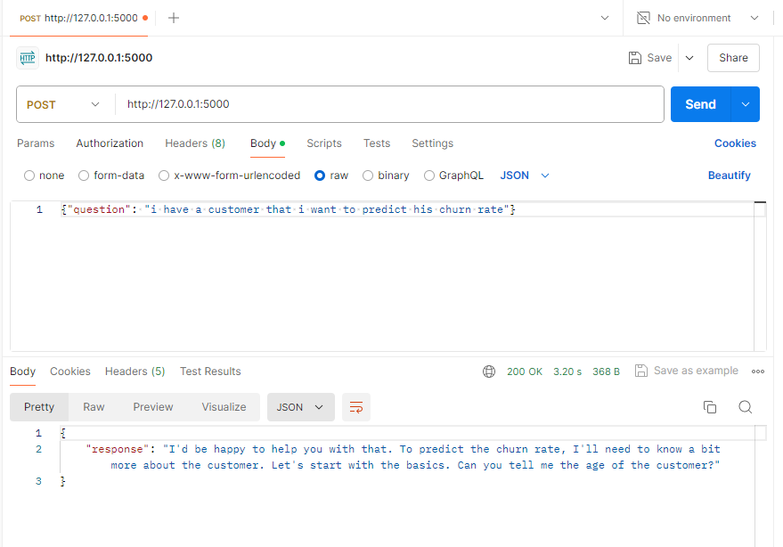

# Marketing Guru Assistant for Churn Prediction API

This project provides an API for predicting customer churn rates using a logistic regression model and a conversational AI interface. The AI is powered by the llama3 chat model, integrated through the LangChain framework. The API interacts with users in a conversational manner to collect the necessary information and provide churn predictions.

## Table of Contents
1. [Project Overview](#project-overview)
2. [Installation](#installation)
3. [Usage](#usage)
4. [API Endpoints](#api-endpoints)
5. [Postman Screenshots](#postman-screenshots)

## Project Overview
This project demonstrates the deployment of a logistic regression model as an API using Flask. The model predicts customer churn rates based on various input features. The API leverages the llama3 chat model via the LangChain framework to interact with users, gather required information, and provide predictions in a conversational format.

### Key Components:
- **Flask**: Serves as the web framework for the API.
- **Logistic Regression Model**: Used for predicting customer churn rates, loaded from a pickle file (`logistic_regression_model.pkl`).
- **LangChain Framework**: Manages the conversational logic and memory.
- **llama3 Chat Model**: Provides the AI responses, accessed via the LangChain integration.

## Installation

1. **Make sure your current directory is Chatbot_FlaskApp**
    ```sh
    cd Chatbot_FlaskApp
    ```

2. **Install the required dependencies:**
    ```sh
    pip install -r requirements.txt
    ```

3. **Set up environment variables:**
    Ensure you have a `.env` file with the necessary environment variables. The provided `.env` file should be in the project directory.

4. **Run the Flask app:**
    ```sh
    python app_flask.py
    ```

## Usage
Once the Flask app is running, you can interact with the API using tools like Postman.

## API Endpoints
### Postman test
This endpoint takes a JSON payload with a user question and returns an AI-generated response.

- **URL:** `http://127.0.0.1:5000`
- **Method:** `POST`
- **Request Body:**
  ```json
  {
      "question": "Your question here"
  }
  ```
- **Response:**
  ```json
  {
      "response": "AI-generated answer"
  }
  ```


## Postman Screenshots
Below are the screenshots from Postman demonstrating the API requests and responses.





