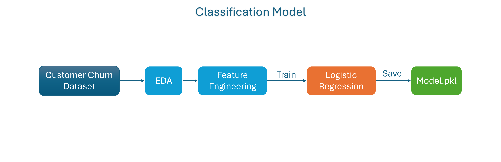
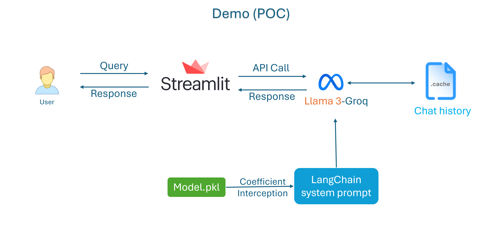
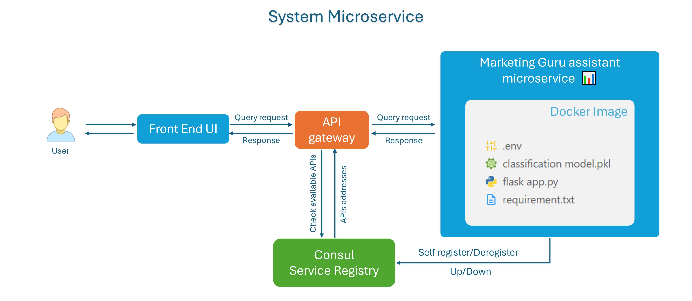

# Marketing Guru Chatbot with Llama3, LangChain, and Logistic Regression

This repository contains the Marketing Guru Chatbot, an AI-powered marketing assistant designed to assist Marketing team members in predicting customer churn rates. The application leverages a conversational interface powered by the llama3 chat model via the LangChain framework
and use Logistic regression model to predict the churn rate

## Table of Contents

- [Features](#features)
- [Architecture](#architecture)
  - [Classification Model Pipeline](#classification-model-pipeline)
  - [Proof of Concept (POC) Demo Pipeline](#proof-of-concept-poc-demo-pipeline)
  - [System Microservice Pipeline](#system-microservice-pipeline)

## Features

- **Advanced NLP:** Utilizes Llama3 for natural language understanding and generation.
- **Conversational AI:** Built with LangChain for seamless and dynamic conversations.
- **Predictive Analytics:** Employs Logistic Regression for making data-driven marketing predictions.
- **User-friendly Interface:** Easy-to-use interface for marketing professionals and enthusiasts.
- **API for microservice deployment:** 

## Architecture

### Classification Model Pipeline

This pipeline is responsible for training the Logistic Regression model used for predictive analytics.

1. **Customer Churn Dataset:** The input dataset containing customer data and churn information.
2. **Exploratory Data Analysis (EDA):** Analyze the dataset to understand the structure, patterns, and relationships within the data.
3. **Feature Engineering:** Transform raw data into meaningful features that improve the performance of the machine learning model.
4. **Logistic Regression:** Train a Logistic Regression model using the engineered features.
5. **Save Model:** Save the trained model as `Model.pkl` for later use.

### Proof of Concept (POC) Demo Pipeline

This pipeline demonstrates the chatbot's capabilities and workflow.

1. **User Interaction:** The user interacts with the chatbot through a web interface built with Streamlit.
2. **Streamlit:** Handles user queries and responses, making API calls to Llama3.
3. **Llama3:** Processes the API calls and generates responses based on the chat history.
4. **Chat History:** Maintains a cache of the conversation history for context.
5. **LangChain System Prompt:** Utilizes the Logistic Regression model (`Model.pkl`) to provide coefficients and intercepts that aid in generating system prompts.

### System Microservice Pipeline

This pipeline outlines the microservice architecture of the system.

1. **User Interaction:** The user sends queries and receives responses through a front-end UI.
2. **API Gateway:** Routes query requests and responses between the front-end UI and the Marketing Guru microservice.
3. **Consul Service Registry:** Manages the availability and addresses of microservices.
4. **Marketing Guru Assistant Microservice:** Contains the Docker image with all necessary components (e.g., `classification model.pkl`, `flask app.py`, `requirement.txt`) to run the chatbot service.

