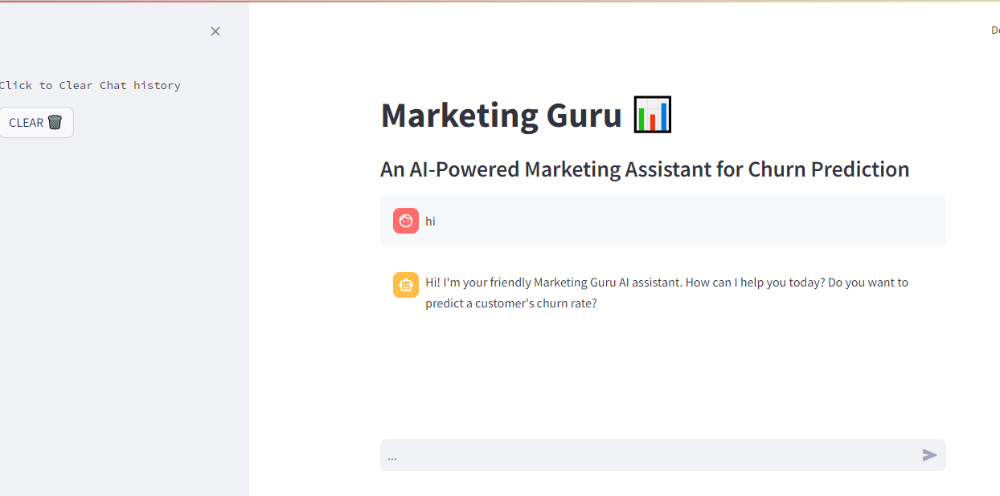

# Marketing Guru 📊

Marketing Guru is an AI-powered marketing assistant designed to predict customer churn rates. The application leverages a conversational interface powered by the llama3 chat model via the LangChain framework, integrated within a Streamlit app.

## Table of Contents
1. [Project Overview](#project-overview)
2. [Installation](#installation)
3. [Usage](#usage)
4. [Demo Video](#demo-video)
5. [Contributing](#contributing)
6. [License](#license)

## Project Overview
Marketing Guru is a conversational AI tool that helps marketing teams predict customer churn rates. The AI interacts with users to collect necessary information and provides churn predictions based on a logistic regression model. The application is built with Streamlit for the frontend interface and uses the llama3 chat model through the LangChain framework for the AI-driven conversation.

### Key Components:
- **Streamlit**: Provides the web interface for the application.
- **LangChain Framework**: Manages the conversational logic and memory.
- **llama3 Chat Model**: Powers the AI responses, integrated via LangChain.
- **Logistic Regression Model**: Calculates churn predictions based on user inputs.

## Installation
To set up the project locally, follow these steps:

1. **Clone the repository:**
    ```sh
    git clone <repository_url>
    cd <repository_directory>
    ```

2. **Create a virtual environment:**
    ```sh
    python3 -m venv venv
    source  venv/Scripts/activate   # On Linux, use `venv/bin/activate`
    ```

3. **Install the required dependencies:**
    ```sh
    pip install -r requirements.txt
    ```

4. **Set up environment variables:**
    Ensure you have a `.env` file in the project directory with the necessary environment variables. For example:
    ```
    GROQ_API_KEY=your_groq_api_key
    ```

5. **Run the Streamlit app:**
    ```sh
    streamlit run app.py
    ```

## Usage
Once the Streamlit app is running, you can interact with Marketing Guru through the web interface. The AI will guide you through a conversation to collect information required for predicting customer churn rates.

### Example Interaction:
1. Open the web browser and navigate to the provided URL by Streamlit (usually `http://localhost:8501`).
2. Start the conversation by entering your questions or information requests in the chat input.
3. The AI will respond and guide you through the process of providing necessary details for the churn prediction.
4. View the predicted churn rate and additional insights provided by the AI.

## Demo Video
Watch the following demo video to see Marketing Guru in action:

[](demo/demo.mp4)

## Project Files
- `app.py`: The main Streamlit application file that sets up the conversational AI interface and manages the interaction logic.
- `.env`: Environment variables file. Ensure this file contains your GROQ API key.
- `requirements.txt`: A file listing all the dependencies required to run the application.
- `demo_video.mp4`: A demo video showcasing the usage of the application.
